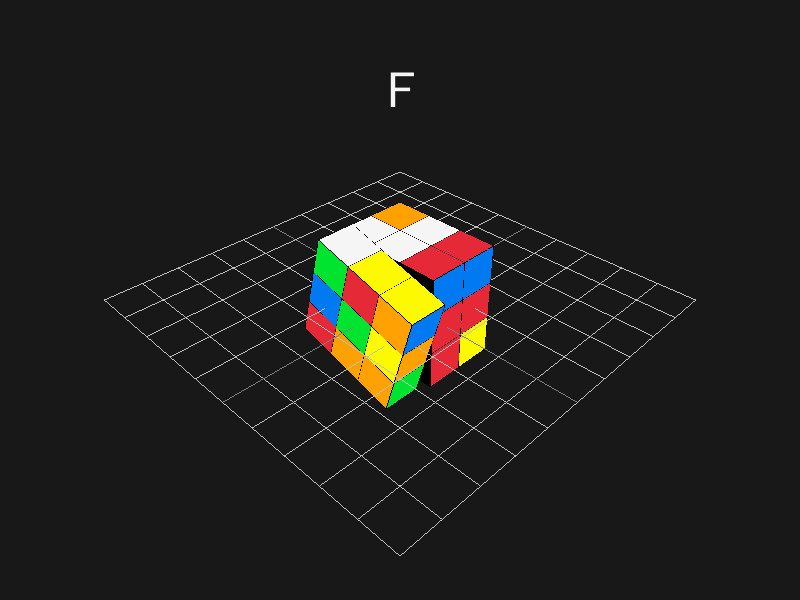

# Rubik's Cube simulation
Rubik's Cube simulation in 3D using C and raylib.

It includes solvers like:
- A naive CFOP
  - https://jperm.net/3x3/cfop
- Herbert Kociemba optimal solver ported to C and using pthreads.
  - https://kociemba.org/cube.htm
  - https://github.com/hkociemba/RubiksCube-OptimalSolver/tree/master - impressive repo
  - This solver just embeds the pregenerated files into c files in the generated folder, the port is just about the solver
  - As an example the port solves `RDDRUFUUFDLRBRFDLRLBLFFDLRBUBRDDBBUUUUBULDDRFFLBRBFFLL` in about 1min (sequentially, in parallel takes 2 seconds) while the original takes 5min using pypy!

## Input
- To apply moves (perform face twists) use: <kbd>U</kbd>-up, <kbd>L</kbd>-left, <kbd>F</kbd>-front, <kbd>R</kbd>-right, <kbd>B</kbd>-back and <kbd>D</kbd>-down.
  (for counter-clockwise hold <kbd>Shift</kbd>)
- To scramble the cube use <kbd>S</kbd>.

## Example Scrambles

- thistlethwaite shuffle:           `U2B2R'F2R'U2L2B2R'B2R2U2B2U'LR2ULFD2R'F'`
- random shuffle I use for testing: `BR'RDRU'DD'U'BD2DB2D'B'L2L2U2DF'U'L2DB'F2RDBB'D`

## TODOs
 - [ ] add loading bar while calculating solution
 - [ ] fix solver so it takes the best solution rather than fastest or make it configurable
 - [ ] add all inputs to readme + fix f1+shift because for long solution is not working
 - [ ] add toggleable dark mode